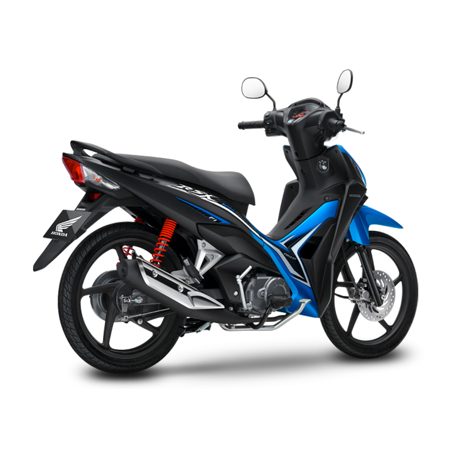
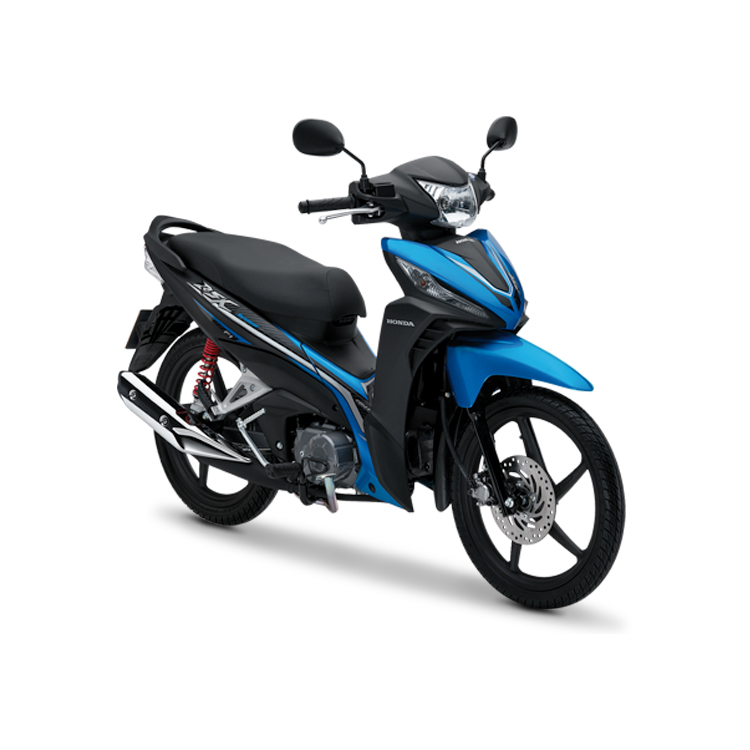

---
priority: b
title: Wave RSX FI 110cc
layout: ArtistPage
category: artists
path: '/artists/wave-rsx-fi-110cc/'
key: waversx

meta: Wave RSX FI 110cc
keywords: Wave RSX FI 110cc

location: Sài gòn
prices: 24,000,000
orders: http://phukientrangtricuoi.com/payments
messages: https://www.facebook.com/messages/t/dotrangtricuoi
website: 
bandcamp: 
bandcampLabelTrack: 
facebook: 
mixcloud: 
soundcloud: 
youtube: 
discogs: 
---

# Giá cả

Phiên bản Phanh cơ, vành nan hoa	21.490.000 VNĐ
Phiên bản Phanh đĩa vành nan hoa	22.490.000 VNĐ
Phiên bản Phanh đĩa, vành đúc	24.490.000 VNĐ

# Màu sắc

Màu sắc sản phẩm
Xanh (Đen Xanh) 
Xám Đen (Đen Xám) 
Đỏ (Đen Đỏ) 
Trắng (Đen Trắng)

# Dòng xe

Wave RSX FI 110cc - 2008
Wave RSX FI 110cc - 2017

# Review Wave RSX FI 110cc

Thiết kế phía trước
Sự nổi bật của đèn xi nhan góc cạnh khi kết hợp cùng logo RSX mới trên ốp trước hình chữ V mạnh mẽ tạo nên phong cách đậm chất thể thao cho người sử dụng. Đèn pha được thiết kế nhỏ gọn với đường cắt sắc nét, có khả năng chiếu sáng vượt trội, khiến cho mặt trước của xe càng trở nên ấn tượng hơn.

Yếm xe
Những đường gân mạnh mẽ trong hốc hút gió kết hợp với yếm xe tạo nên điểm nhấn thể thao, mạnh mẽ cho Wave RSX mới.

Đồng hồ
Mặt đồng hồ được thiết kế hiện đại, bố trí khoa học, dễ dàng quan sát các thông số vận hành.

Thiết kế tem xe mới
Bứt phá hơn với thiết kế thân xe độc đáo cùng điểm nhấn là tem xe mới được sáng tạo từ logo 3D ấn tượng và các đường nét sắc cạnh chạy dọc theo thân xe, tất cả tạo nên một vẻ đẹp mạnh mẽ đậm chất riêng của Wave RSX mới.

Tay nắm sau
Tay nắm sau thiết kế mới được bọc bởi lớp cao su mềm tạo cảm giác chắc chắn khi cầm nắm hay lúc dắt và đẩy xe.

Động cơ Honda 110cc
Wave RSX mới được trang bị động cơ 110cc, 4 kỳ, xy-lanh đơn, đạt tiêu chuẩn Euro 3, làm mát bằng không khí giúp tối ưu hóa khả năng tăng tốc, tiết kiệm nhiên liệu mà vẫn bền bỉ, vận hành mạnh mẽ & ổn định.
Wave RSX tiết kiệm nhiên liệu hơn 7% dòng xe trước đó và đạt khả năng tăng tốc từ 0-200m nhanh nhất so với các dòng xe cùng loại. *
* Theo số liệu nghiên cứu nội bộ của Honda.

Hệ thống phun xăng điện tử (PGM-FI)
Hệ thông phun xăng điện tử PGM-FI được trang bị trên tất cả phiên bản của Wave RSX mới, giúp cung cấp lượng nhiên liệu phù hợp với điều kiện vận hành & giảm thiểu ma sát, tiết kiệm nhiên liệu, vận hành êm ái và cảm giác thoải mái hơn khi tăng tốc.

Tiết kiệm nhiên liệu
Nhờ một số điều chỉnh về mặt động cơ, Wave RSX tiếp tục khẳng định khả năng tiết kiệm nhiên liệu hàng đầu trong phân khúc động cơ 110cc, hơn khoảng 7% so với dòng xe trước đó và đạt khả năng tăng tốc từ 0-200m trong thời gian ngắn nhất so với các dòng xe cùng loại (theo số liệu nghiên cứu nội bộ của Honda).

Hệ thống phanh
Xe được trang bị hệ thống phanh đĩa trước đường kính 220mm và phanh cơ sau đường kính 110mm với lực phanh mạnh mẽ và an toàn cho người sử dụng.
Hệ thống phanh cùng với vành đúc bằng hợp kim nhôm nhẹ tạo thêm ấn tượng thể thao cho xe.

Hộc đựng đồ U-box
Hộc đựng đồ tiện lợi có khả năng chứa được 01 mũ bảo hiểm nửa đầu cùng những vật dụng cá nhân khác.

Khóa từ đa năng
Thiết kế hiện đại 3 trong 1 gồm khóa điện, khóa từ và khóa cổ truyền thống rất tiện lợi và an tâm hơn.

# Thông số kỹ thuật

<table cellpadding="0" cellspacing="0" border="0">
         <tbody><tr>
<td><b>Khối lượng bản thân</b></td>
   <td>102kg (vành đúc), 99kg (vành nan)</td>
 </tr>

              
            
          
            
              
 <tr>
   <td><b>Dài x Rộng x Cao</b></td>
   <td>1.919mm x 709mm x 1.080mm</td>
 </tr>

              
            
          
            
              
 <tr>
   <td><b>Khoảng cách trục bánh xe</b></td>
   <td>1.227mm</td>
 </tr>

              
            
          
            
              
 <tr>
   <td><b>Độ cao yên</b></td>
   <td>760mm</td>
 </tr>

              
            
          
            
              
 <tr>
   <td><b>Khoảng sáng gầm xe</b></td>
   <td>135mm</td>
 </tr>

              
            
          
            
          
            
              
 <tr>
   <td><b>Dung tích bình xăng</b></td>
   <td>4 lít</td>
 </tr>

              
            
          
            
              
 <tr>
   <td><b>Kích cỡ lốp trước/ sau</b></td>
   <td>Trước: 70/90 - 17 M/C 38P   Sau: 80/90 - 17 M/C 50P</td>
 </tr>

              
            
          
            
              
 <tr>
   <td><b>Phuộc trước</b></td>
   <td>Ống lồng, giảm chấn thủy lực</td>
 </tr>

              
            
          
            
              
 <tr>
   <td><b>Phuộc sau</b></td>
   <td>Lò xo trụ, giảm chấn thủy lực</td>
 </tr>

              
            
          
            
              
 <tr>
   <td><b>Loại động cơ</b></td>
   <td>Xăng, 4 kỳ, 1 xi-lanh, làm mát bằng không khí</td>
 </tr>

              
            
          
            
          
            
              
 <tr>
   <td><b>Dung tích xy-lanh</b></td>
   <td>109,1cm3</td>
 </tr>

              
            
          
            
              
 <tr>
   <td><b>Đường kính x hành trình pít-tông</b></td>
   <td>50 mm x 55,6 mm</td>
 </tr>

              
            
          
            
              
 <tr>
   <td><b>Tỉ số nén</b></td>
   <td>9,3:1</td>
 </tr>

              
            
          
            
              
 <tr>
   <td><b>Công suất tối đa</b></td>
   <td>6,56 kW / 7.500 vòng/phút</td>
 </tr>

              
            
          
            
              
 <tr>
   <td><b>Mô-men cực đại</b></td>
   <td>8,77 Nm/6.000 vòng/phút</td>
 </tr>

              
            
          
            
              
 <tr>
   <td><b>Dung tích nhớt máy</b></td>
   <td>1 lít khi rã máy/ 0,8 lít khi thay nhớt</td>
 </tr>

              
            
          
            
          
            
              
 <tr>
   <td><b>Hộp số</b></td>
   <td>Cơ khí, 4 số tròn</td>
 </tr>

              
            
          
            
              
 <tr>
   <td><b>Hệ thống khởi động</b></td>
   <td>Điện/ Đạp chân</td>
 </tr>

              
            
          
  </tbody></table>