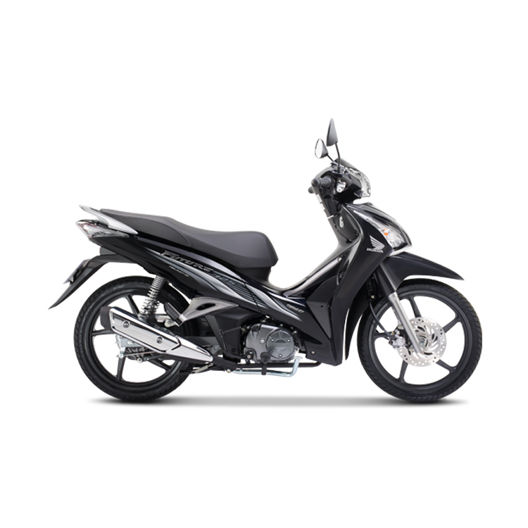

---
priority: b
title: Future 125cc
layout: ArtistPage
category: artists
path: '/artists/future-125cc/'
key: future125cc

meta: Future 125cc
keywords: Future 125cc

location: sài gòn
prices: 30,000,000
orders: http://phukientrangtricuoi.com/payments
messages: https://www.facebook.com/messages/t/dotrangtricuoi
website: 
bandcamp: 
bandcampLabelTrack: 
facebook: 
mixcloud: 
soundcloud: 
youtube: 
discogs: 
---

# Giá cả

Phiên bản vành nan hoa	29.990.000 VNĐ
Phiên bản vành đúc	30.990.000 VNĐ

# Màu sắc

Màu sắc sản phẩm
Đen xám 
Nâu vàng đồng 
Đen đỏ xám 
Đỏ ghi xám 
Xám ghi 
Xanh xám

# Dòng xe

Future 125cc - 2013
Future 125cc - 2014

# Review Future 125cc

Thiết kế
Thiết kế mới đậm chất thể thao và sang trọng, cuốn hút người đối diện từ mọi góc nhìn.

Thiết kế phía trước mạnh mẽ
Mặt trước của xe Future được thiết kế theo hình chữ V (V-shape) cùng với hệ thống đèn pha đôi có cường độ ánh sáng mạnh, hệ thống đèn xi nhan và đèn định vị nổi bật tạo sự mạnh mẽ đầy cá tính khi nhìn từ phía trước

Cụm đèn sau ấn tượng
Công nghệ đèn LED được sử dụng cho hệ thống đèn hậu kết hợp với đèn xi nhan được thiết kế liền khối, mạnh mẽ và hài hòa với hệ thống đèn pha phía trước, mang lại dáng vẻ quyền uy, sang trọng của một chiếc xe số danh tiếng.

Mặt đồng hồ cao cấp
Thiết kế cao cấp và khoa học, có khả năng phản xạ ánh sáng giúp làm nổi bật các chi tiết tinh tế trên mặt đồng hồ, các thông số được thể hiện đầy đủ và nằm trong tầm mắt giúp người lái dễ dàng quan sát.

Tem xe mới phong cách
Được thiết kế ấn tượng và thuôn gọn dọc đường cong của thân xe, tạo nên phong cách hiện đại và năng động cho người lái.

Hộc đựng đồ U-box với dung tích lớn
Nhờ thiết kế khung xe phù hợp, hộc đựng đồ với dung tích lớn có thể chứa được mũ bảo hiểm cả đầu cùng nhiều vật dụng cá nhân khác.

Bình xăng lớn
Future được thiết kế với bình xăng có dung tích lớn 4,6 lít, cùng khả năng tiết kiệm nhiên liệu ưu việt hàng đầu giúp đem lại sự thoải mái, yên tâm cho người sử dụng khi di chuyển trên những quãng đường dài.

Ổ khóa đa năng và an toàn
Thiết kế hiện đại "4 trong 1" bao gồm khóa điện, khóa từ, khóa cổ và khóa yên, an toàn, dễ sử dụng và chống rỉ sét hiệu quả.

Công nghệ và an toàn
Với ý tưởng phát triển chiếc xe số cao cấp hàng đầu, Future mới có nhiều cải tiến ưu việt ở động cơ, giúp xe vận hành mạnh mẽ và bảo vệ môi trường.

Hệ thống phun xăng điện tử (PGM-FI)
Kiểm soát và cung cấp lượng nhiên liệu phù hợp với điều kiện vận hành nhờ hoạt động lập trình vi tính chính xác, giúp xe tiết kiệm nhiên liệu hơn 7,6% (theo kết quả thử nghiệm của Honda) và đạt mức tiêu hao nhiên liệu tốt nhất so với dòng xe số 125cc cùng loại.

Đáp ứng nghiêm ngặt tiêu chuẩn khí thải Euro 3
Động cơ xe được trang bị hệ thống trung hòa khí thải tiên tiến tri-metal (xúc tác 3 kim loại Pd/ Pt/ Rh) đặc biệt thân thiện với môi trường.

# Thông số kỹ thuật

<table cellpadding="0" cellspacing="0" border="0">

          
          
            
              
 <tbody><tr>
   <td><b>Khối lượng bản thân</b></td>
   <td>Bản vành nan hoa: 103 Kg   Bản vành đúc: 104 Kg</td>
 </tr>

              
            
          
            
              
 <tr>
   <td><b>Dài x Rộng x Cao</b></td>
   <td>1.932mm x 711mm x 1.092mm</td>
 </tr>

              
            
          
            
              
 <tr>
   <td><b>Khoảng cách trục bánh xe</b></td>
   <td>1.258mm</td>
 </tr>

              
            
          
            
              
 <tr>
   <td><b>Độ cao yên</b></td>
   <td>758mm</td>
 </tr>

              
            
          
            
              
 <tr>
   <td><b>Khoảng sáng gầm xe</b></td>
   <td>135mm</td>
 </tr>

              
            
          
            
          
            
              
 <tr>
   <td><b>Dung tích bình xăng</b></td>
   <td>4,6 lít</td>
 </tr>

              
            
          
            
              
 <tr>
   <td><b>Kích cỡ lốp trước/ sau</b></td>
   <td>Trước: 70/90 - 17 M/C 38P  Sau: 80/90 - 17 M/C 50P</td>
 </tr>

              
            
          
            
          
            
          
            
              
 <tr>
   <td><b>Loại động cơ</b></td>
   <td>Xăng, 4 kỳ, 1 xy lanh, làm mát bằng không khí</td>
 </tr>

              
            
          
            
              
 <tr>
   <td><b>Hệ thống cung cấp nhiên liệu</b></td>
   <td>Phun xăng điện tử</td>
 </tr>

              
            
          
            
              
 <tr>
   <td><b>Dung tích xy-lanh</b></td>
   <td>124,9cm3</td>
 </tr>

              
            
          
            
              
 <tr>
   <td><b>Đường kính x hành trình pít-tông</b></td>
   <td>52,4mm x 57,9mm</td>
 </tr>

              
            
          
            
              
 <tr>
   <td><b>Tỉ số nén</b></td>
   <td>9,3:1</td>
 </tr>

              
            
          
            
              
 <tr>
   <td><b>Công suất tối đa</b></td>
   <td>7,08 kW/7.500 vòng/phút</td>
 </tr>

              
            
          
            
              
 <tr>
   <td><b>Mô-men cực đại</b></td>
   <td>10,6 N.m/5.500 vòng/phút</td>
 </tr>

              
            
          
            
          
            
              
 <tr>
   <td><b>Loại truyền động</b></td>
   <td>Cơ khí, 4 số tròn</td>
 </tr>

              
            
          
            
          
            
              
 <tr>
   <td><b>Hệ thống khởi động</b></td>
   <td>Điện/ Đạp chân</td>
 </tr>

              
            
          
  </tbody></table>